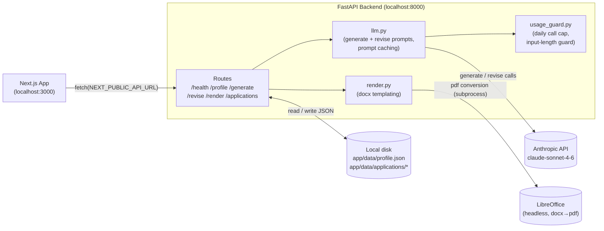
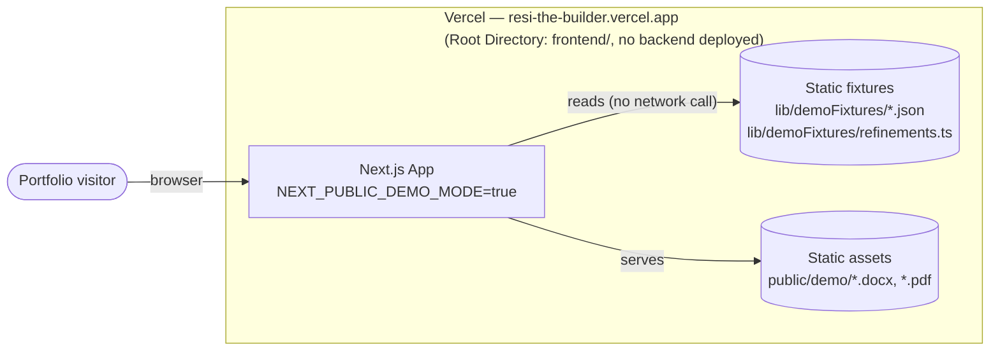

# Architecture

Current-state reference for how this project is actually built and deployed, as of
2026-09-18. Unlike `STATUS.md` / `backend/STATUS_BACKEND.md` / `frontend/STATUS_FRONTEND.md`
(chronological build logs — what was done, when, and how it was verified) or
`backend/CLAUDE_CODE_CONTEXT.md` (the original spec — why things were designed a certain
way), this file is a snapshot: it should be edited/replaced as the architecture changes,
not appended to.

## What this project is

A personal tool that tailors a resume/cover letter to a job description using Claude, lets
you revise pieces via chat, and renders the result to `.docx`/`.pdf`. It now has **two
distinct deployment topologies** that share one frontend codebase but behave very
differently — this doc covers both.

---

## 1. Local full-stack (real app, development)

The actual working tool: Next.js frontend + FastAPI backend + Anthropic API, run together
locally by the user.

**Backend** (`backend/app/`, FastAPI):
- `main.py` registers 5 routers (`profile`, `generate`, `revise`, `render`, `applications`)
  plus a bare `/health`. CORS is wide open (`allow_origins=["*"]`) — local-only, no
  deployed frontend origin to lock it down to yet.
- `routes/` — one file per resource, thin: parse request, call a service, shape the
  response, map errors to HTTP status codes (400/404/429/502/500 as appropriate).
- `services/llm.py` — all Anthropic API calls live here: `generate_resume`,
  `generate_cover_letter`, `revise_resume`, `revise_cover_letter`, `revise_profile`. Uses
  prompt caching (ephemeral breakpoints on a shared system-prompt preamble and the
  profile-data block) so repeated generations of the same document type, or successive
  generations across job postings in one sitting, reuse a cached prefix instead of paying
  full input-token price every call.
- `services/render.py` — pure templating via `python-docx`, no LLM call. PDF export shells
  out to a headless LibreOffice process (`SOFFICE_PATH`, hardcoded to the macOS Homebrew
  cask location) to convert the generated `.docx`.
- `services/usage_guard.py` — an in-memory daily call cap (`DAILY_CALL_LIMIT = 50`) and a
  max-input-length guard, both supplementary to (not a replacement for) an Anthropic
  console spend limit.
- **Storage**: no database. `app/data/profile.json` is the master profile (git-tracked).
  `app/data/applications/{id}/` (gitignored) holds one folder per saved package: JD
  text (raw + cleaned), `resume.json`/`cover_letter.json`, and pre-rendered
  `resume.docx`/`cover_letter.docx` snapshots written at save time.

**Frontend** (`frontend/app/`, Next.js 16 + React 19 + Tailwind v4):
- `page.tsx` — the whole app shell: top bar, tab state (`jd | resume | cover_letter |
  saved | profile`), per-tab generate/revise/history state, wired to the backend via
  `fetch(process.env.NEXT_PUBLIC_API_URL)`.
- `components/` — `ResumePreview`/`CoverLetterPreview`/`ProfilePreview` (selection +
  inline editing), `RevisionChat` (chat-scoped revise), `SavedTab`/`SaveButton`
  (`/applications` CRUD), `DownloadButtons` (`/render`), `HamburgerMenu` → Profile/Saved.
- `lib/` — pure functions operating on the `Resume`/`CoverLetter`/`Profile` JSON shapes
  (`resume.ts`, `profile.ts`), plus `autoApplyPrompt.ts` (assembles the Claude-in-Chrome
  automation prompt for the Auto Apply feature — pure text templating, no LLM call).

---

## 2. Vercel demo (public portfolio deployment)

A **frontend-only** deployment with **zero backend dependency** — no server calls, no
Anthropic API key anywhere near the client, $0 to host. Exists purely so the project can be
shown off via a live link without incurring real API cost or exposing credentials.

**Why this is possible at all**: `backend/` could never deploy to Vercel regardless of the
demo-cost question — `/render`'s PDF path shells out to LibreOffice, a system binary
serverless functions can't run. So the demo had to be frontend-only from the start.

**Mechanism** (`app/lib/demo.ts`, `app/lib/DemoModeContext.tsx`):
- `BUILD_DEMO_MODE` — the permanent, build-time value of `NEXT_PUBLIC_DEMO_MODE`, set only
  in Vercel's project environment variables (never in local `.env.local`).
- Every real `fetch()` call site (`page.tsx`, `ProfileView.tsx`, `SavedTab.tsx`,
  `DownloadButtons.tsx`, `SaveButton.tsx`) branches on demo mode and returns
  static/pre-baked data instead — one real saved application package (JD + resume + cover
  letter, sourced from real content), plus a small `id → refined text` map
  (`refinements.ts`) standing in for `/revise`.
- A runtime **Live/Demo toggle** (`DemoModeToggle.tsx`) exists for local testing only —
  gated on `BUILD_DEMO_MODE` at the component level (renders `null` outright when true),
  confirmed via grepping a real `NEXT_PUBLIC_DEMO_MODE=true` production build's output:
  the toggle's text and its localStorage key don't exist anywhere in the shipped
  HTML/JS — genuinely tree-shaken out, not just hidden behind a runtime check. A public
  demo visitor has no code path that could ever re-enable real network calls.

---

## Open architectural gaps (not urgent, worth knowing)

- **No stable hostname for the local backend** — a Cloudflare Tunnel was planned (see
  `TODO.md`) to let a *real* hosted frontend reach it, independent of the demo above.
  Not started; the demo's zero-backend design made this less urgent.
- **CORS is wide open** (`allow_origins=["*"]`) since there's no deployed real-backend
  frontend origin yet to restrict it to.
- **`SOFFICE_PATH` is hardcoded** to the default macOS Homebrew cask location — would need
  updating if the backend ever runs on a different OS/machine.
