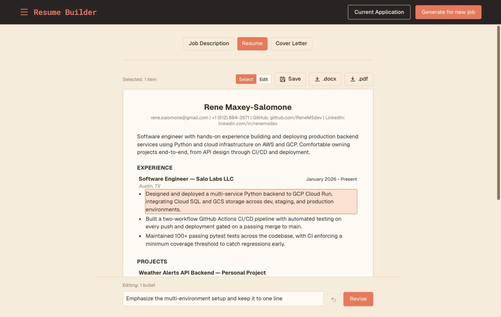
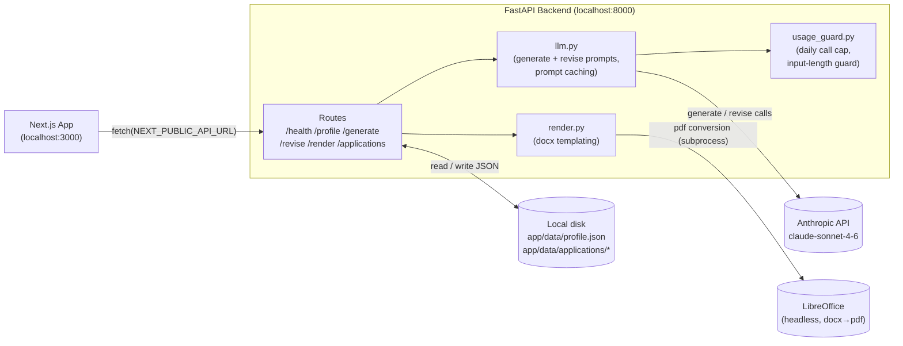
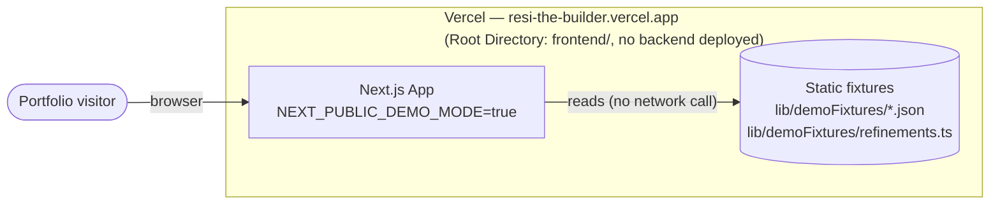

# Resume Builder

Personal tool to speed up job applications. Paste a job description, get a Claude-tailored
resume or cover letter generated from a master profile, edit pieces via chat-scoped
revision, then download a formatted `.docx`/`.pdf`.

**Live demo:** [resi-the-builder.vercel.app](https://resi-the-builder.vercel.app) — runs
on sample data with canned revisions; AI generation, downloads, and Auto Apply are
disabled there.

## Screenshot



## Features

- **Tailored generation** — Claude selects and rewrites content from a master profile to
  fit each job description, for both resumes and cover letters.
- **Chat-scoped revision** — select a bullet, entry, section, or paragraph and give an
  instruction; only the selected pieces are rewritten, nothing else drifts.
- **Inline editing** — switch to Edit mode to type changes in directly.
- **Profile editing** — revise the master profile the same way, with an explicit "Apply to
  Profile" write step.
- **Export** — formatted `.docx`, or `.pdf` via headless LibreOffice.
- **Saved applications** — save, reload, and update a full package (job description,
  resume, cover letter) per job.
- **Auto Apply** — assembles a Claude-in-Chrome prompt from a saved package that fills out
  a job site's application form. Fill-only: it never submits.

## Tech stack

- **Frontend:** Next.js 16, React 19, TypeScript, Tailwind CSS v4
- **Backend:** Python 3.13, FastAPI, Pydantic v2, pytest
- **AI:** Anthropic Claude API (`claude-sonnet-4-6`) with prompt caching
- **Documents:** python-docx, LibreOffice (headless, docx → pdf)
- **Automation:** Claude Code + Claude in Chrome
- **Hosting:** Vercel (demo only)

## Architecture

The real app runs locally as a full stack:



The public demo at [resi-the-builder.vercel.app](https://resi-the-builder.vercel.app) is
frontend-only, serving static fixtures with no backend or API key:



See [`docs/ARCHITECTURE.md`](docs/ARCHITECTURE.md) for the full breakdown.

## Running locally

### Prerequisites

- Python 3.13 (not 3.14 or 3.12 — see `backend/STATUS_BACKEND.md` for why)
- Node.js (for the frontend)
- [LibreOffice](https://www.libreoffice.org/) installed locally (`brew install --cask libreoffice`
  on macOS) — required for PDF export via the backend's `/render` endpoint
- An Anthropic API key

Both servers run locally. Start the backend first, then the frontend.

### 1. Backend

```bash
cd backend
python3.13 -m venv .venv        # first time only
source .venv/bin/activate
pip install -r requirements.txt # first time only
```

Copy `.env.example` to `.env` and fill in a real key:

```bash
cp .env.example .env            # then edit .env and set ANTHROPIC_API_KEY
```

Run the server:

```bash
uvicorn app.main:app --reload --port 8000
```

Open `http://127.0.0.1:8000/docs` for the interactive Swagger UI to test endpoints
directly. See `backend/README.md` for more.

### 2. Frontend

In a separate terminal:

```bash
cd frontend
npm install                     # first time only
```

Create `frontend/.env.local` pointing at the backend:

```bash
echo "NEXT_PUBLIC_API_URL=http://127.0.0.1:8000" > .env.local
```

Run the dev server:

```bash
npm run dev
```

Open `http://localhost:3000` in your browser. See `frontend/README.md` for more.

## Notes

- Both servers must be running for the app to work — the frontend calls the backend
  directly over HTTP, no proxy in between.
- CORS on the backend is wide open (`allow_origins=["*"]`) for local dev.
- The backend enforces a daily call cap and input-length limits as guardrails against
  runaway API spend — see `backend/STATUS_BACKEND.md` for details. Set a spend limit in
  the Anthropic console as the real backstop.

## Project docs

- [`docs/STATUS.md`](docs/STATUS.md): current project status, with verification evidence.
  `backend/STATUS_BACKEND.md` and `frontend/STATUS_FRONTEND.md` hold implementation detail.
- [`docs/ARCHITECTURE.md`](docs/ARCHITECTURE.md) — both deployment topologies in depth.
- [`docs/TODO.md`](docs/TODO.md): backlog and deferred scope.
- [`docs/decisions.md`](docs/decisions.md): decisions and the reasons behind them.
